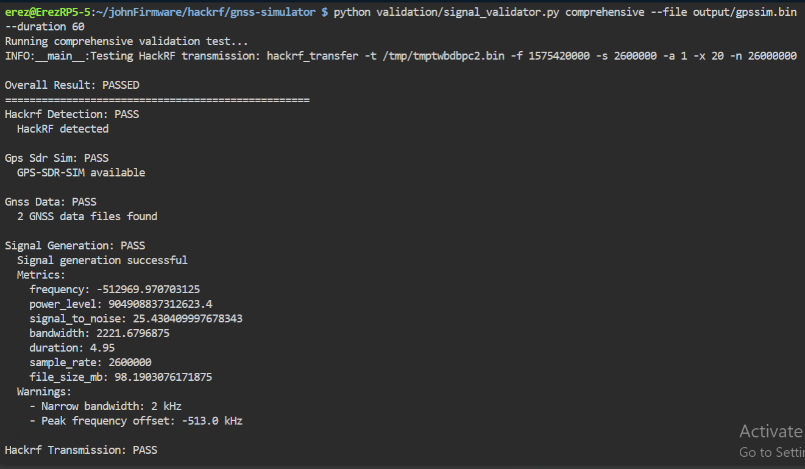

# GNSS Simulator Installation and Testing Instructions

## Installation Steps

1. **Run the installation script**

   The installation script `install.sh` sets up the environment on a Raspberry Pi 5 with HackRF One. It installs dependencies, builds GPS-SDR-SIM, sets permissions, and creates helper scripts.

   ```bash
   cd gnss-simulator/scripts
   ./install.sh
   ```

2. **Reboot the system**

   After installation, reboot to apply system changes:

   ```bash
   sudo reboot
   ```

3. **Connect HackRF One**

   Connect the HackRF One device via USB.

4. **Test the system**

   Run the system test script to verify hardware and software setup:

   ```bash
   ./test-system.sh
   ```

5. **Quick test of GNSS signal transmission**

   Use the quick start script to run a fixed position test (London coordinates):

   ```bash
   ./quick-start.sh
   ```

6. **Start the API server**

   To start the FastAPI server for API-driven simulation:

   ```bash
   python3 src/main.py server --host 0.0.0.0 --port 8000
   ```

   Access API documentation at:

   ```
   http://<device-ip>:8000/docs
   ```

---

## Using Configuration File for Signal Generation

You can now use a JSON configuration file to specify signal generation parameters instead of command-line arguments.

Example config file (`config.json`):

```json
{
  "signal": {
    "location": [51.5074, -0.1278, 100],
    "duration": 60,
    "gain": 30
  },
  "data": {
    "rinex_directory": "/home/erez/gnss-data",
    "rinex_filename": "brdc1800.25n"
  }
}
```

### Running with Config File

To run the test command using the config file:

```bash
python3 src/main.py test --config-file config.json
```

```bash
   
   python validation/signal_validator.py comprehensive --file output/gpssim.bin --duration 60
  ```


   ## Testing and Validation

   ### Milestone 1: Core GNSS Signal Generation (Fixed Position)

   - Run the test command with config file or command-line parameters:
   .png>)
```bash
   ✅ Manual Transmission: Success
   Your manual hackrf_transfer command transmitted successfully:
   hackrf_transfer -t output/gpssim.bin -f 1575420000 -s 2600000 -a 1 -x 20
   Output confirms:
   Streaming at ~5.2 MiB/sec
   Average power ~–4.7 dBfs
   No HackRF errors
   ```

```bash
    python3 src/main.py test --config-file config.json
  ```
.png>)
- Confirm console output shows signal transmission started and runs for the specified duration.
- Use a GPS test app on Android or iPhone to verify:
 - ANDROID
   [GPSTest](https://play.google.com/store/apps/details?id=com.android.gpstest)
   [GPS Status & Toolbox](https://play.google.com/store/apps/details?id=com.eclipsimgpsstatus2)
 - IPHONE

```
   For iPhone (iOS)
   iPhones are more restrictive, but we can still test:
```
   [GNSS View](https://apps.apple.com/us/app/gnss-view/id1470130467)

   Satellite info, fix status, sky view

   [SpySat GPS Tracker](https://apps.apple.com/us/app/spysat-gps-tracker/id959903289)
   ```
   Logs GPS position over time

   Works well when testing dynamic simulations

   🛑 iOS doesn’t allow full GPS spoofing via USB or RF easily — you’ll need to use a real GNSS receiver connected to the spoofed signal (see below).

   ✅ For Hardware Receivers
   If you're testing with HackRF or another SDR device, you can connect:

   USB GPS dongles (like the u-blox 7/8/9)

   Raspberry Pi with GPS HAT

   Dedicated GNSS receivers (like SparkFun SAM-M8Q or Adafruit Ultimate GPS)

   These should receive the simulated signal if:

   They're within range of the HackRF’s RF transmission (or connected via cable + attenuator)

   Configured for GPS L1 (1575.42 MHz)

   You can log and visualize data with:
   ```
  - Map position
  - Satellites visible
  - Date and time
  - GPS fix

### Milestone 2 & 3: API Driven Simulation

- Start the API server as above.
- Use API testing tools (Postman, curl) to call endpoints for static location and route simulation.
- Verify GPS test apps reflect simulated data from the API.

### Signal File Generation

- Generate GNSS signal file without transmission:

  ```bash
  python3 src/main.py generate --config-file config.json
  ```

- Confirm the output path of the generated signal file.
- Optionally, use the file in downstream tools.

### Status Check

- Check system status:

```bash
  python3 src/main.py status
  ```

- Confirm printed system information.

---

## Additional Notes

- Logs are saved to `/home/erez/gnss-simulator/logs/gnss-simulator.log` by default.
- To enable auto-start of the simulator service:

```bash
  sudo systemctl enable gnss-simulator
  sudo systemctl start gnss-simulator
  ```

- For support and troubleshooting, refer to Milestone 4 deliverables.

---

This completes the updated installation and testing instructions for the GNSS Simulator project.
